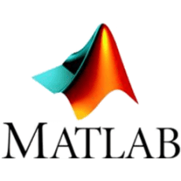

# 潘龙旭 (Derek Pan) 👋
### Georgia Institute of Technology (2021 - )
### Purdue University (2017 - 2021)
### - Major: Aeronautical and Astronautical Engineering
### - Concentration: Autonomy and control

- Chinese
- Hobbies:
    🎸 & 🏀 & 🎮 & math
- 🌱 Currently learning: 
    
- 👯 Looking to collaborate on any beginning programmer projects.

## Skills

 
 

--- 
